Le but de cet exercie est de creer un framework qui permet de generer des diagrammes de classe en utilisant les design patterns stategy, adapter et observer
1. le diagramme de classe du framework:
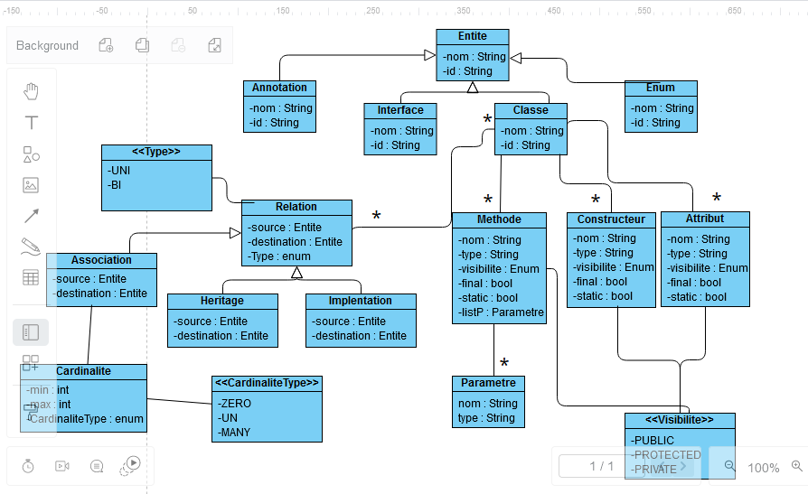
2. implémentation JAVA de ce Framework
la classe abstraite Entite : 
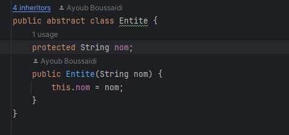
3. Les classe Classe,Enum,Interface, Record
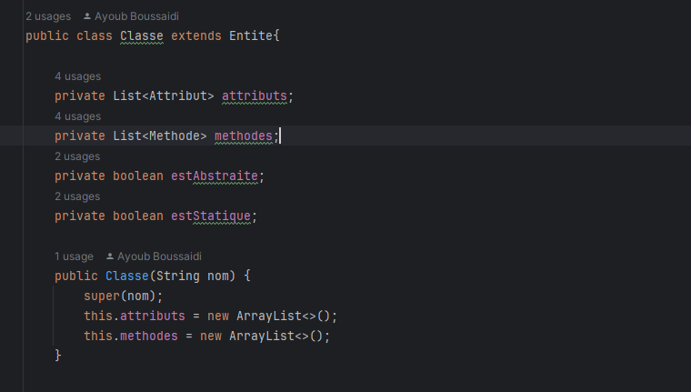
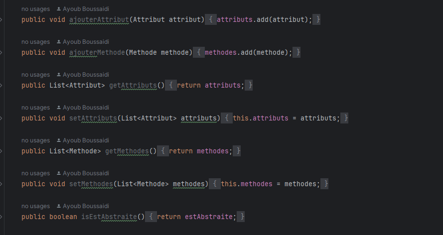
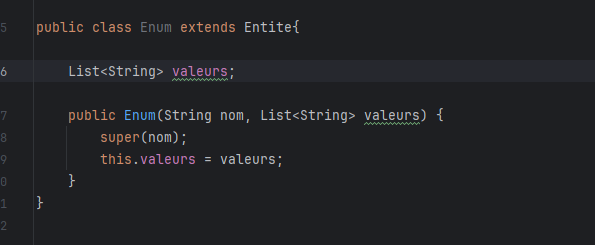
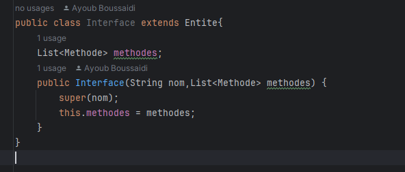
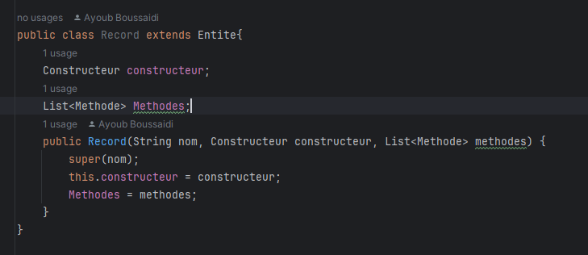
4. L'interface Relation et ces implementations
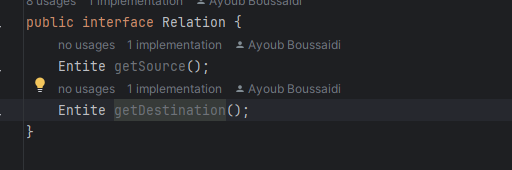
Association :
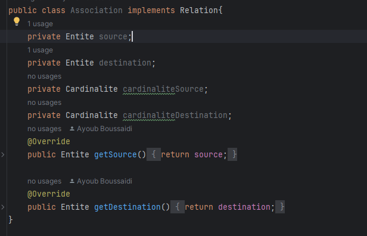
Heritage : 
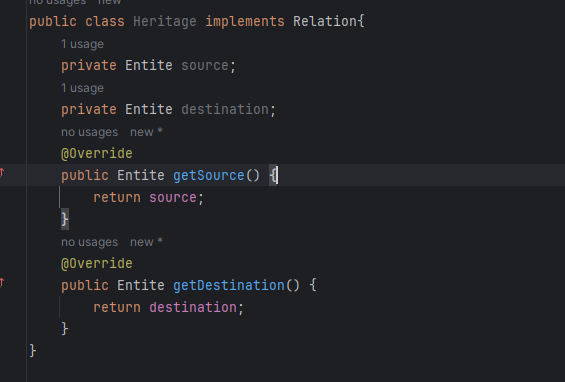
5. La logique du genration du code avec le pattern strategy :
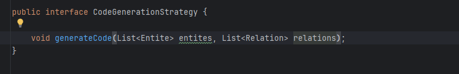
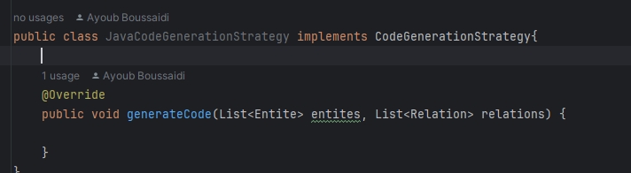
6. 